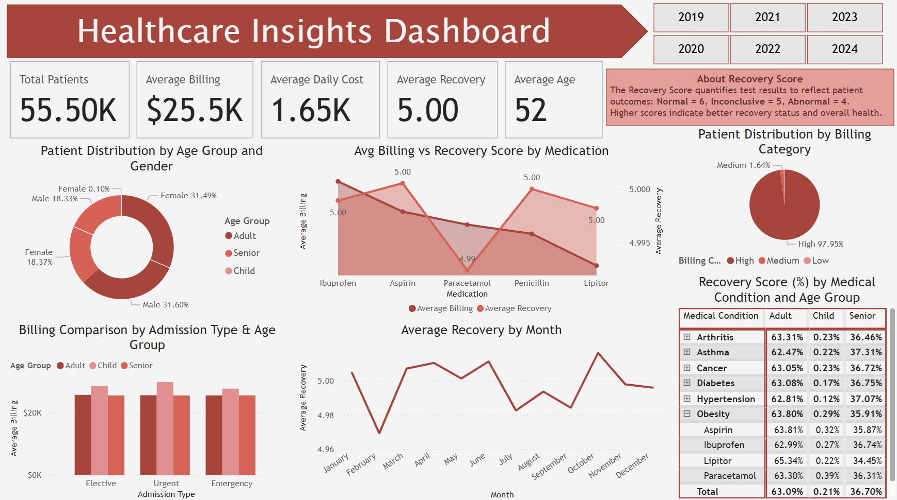

## 📊 Healthcare Analysis Dashboard – Power BI

This project presents a comprehensive **healthcare analytics dashboard** built using **Power BI**, based on a synthetic healthcare dataset. The dashboard showcases meaningful insights into patient demographics, billing patterns, medical conditions, and recovery outcomes.

---

### 🔗 Live Dataset Source:
[📥 Download Dataset from Kaggle](https://www.kaggle.com/datasets/teajay/global-healthcare-data)

---
## 🖼️ Dashboard Preview:

---

### ✅ Key Features

- KPIs: Total Patients, Billing, Recovery Score, Age
- Demographic Analysis: Age Group & Gender
- Billing by Admission Type, Medication
- Recovery Trends by Month
- Interactive Slicers (Year, Billing Category, Hospital)

---

### 📘 Recovery Score Logic

| Test Result     | Score |
|------------------|--------|
| Normal           | 6      |
| Inconclusive     | 5      |
| Abnormal         | 4      |

---

### 🛠 Tools Used
- Power BI
- DAX
- Data Modeling
